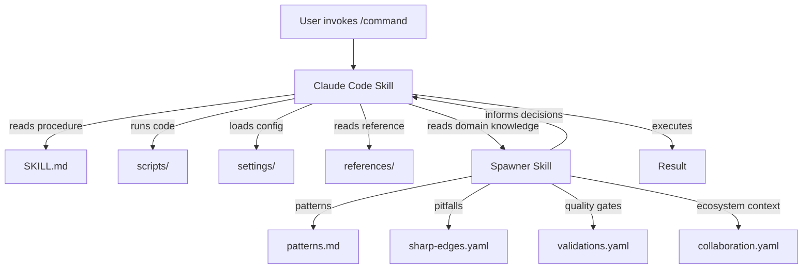
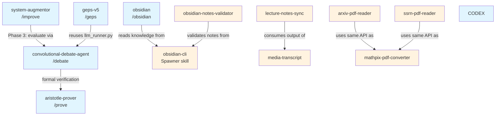

# Architecture

The 14 skills in this repo split across two systems that serve fundamentally different purposes. Understanding the split is the key to using them well.

## Two Systems, One Goal

**Claude Code skills** are executable workflows. They have a `SKILL.md` that tells Claude what to do, `scripts/` that run code, `settings/` that configure behavior, and `references/` that provide context. When you type `/prove` or `/debate`, Claude reads the skill and executes a multi-step procedure -- calling APIs, launching agents, parsing outputs, writing files.

**Spawner skills** are domain knowledge packs. They have 4 YAML files encoding structured expertise and 4 Markdown files with narrative depth. They don't execute anything. Claude reads them as reference material to avoid known pitfalls, follow proven patterns, and make better decisions within a domain.

The distinction matters because trying to use one system for the other's job produces bad results. Putting execution logic in a Spawner skill means it never runs. Putting domain knowledge in a Claude Code SKILL.md means it bloats the execution context and doesn't get the structured format (sharp edges, validations, collaboration rules) that makes knowledge actually useful.

## Structure Comparison

```
Claude Code Skill                    Spawner Skill
~/.claude/skills/<name>/             ~/.spawner/skills/<category>/<name>/
├── SKILL.md          (behavior)     ├── skill.yaml           (definition)
├── scripts/          (executable)   ├── sharp-edges.yaml     (pitfalls)
│   ├── main.py                      ├── validations.yaml     (quality gates)
│   └── helper.sh                    ├── collaboration.yaml   (ecosystem)
├── settings/         (config)       ├── patterns.md          (what works)
│   └── config.json                  ├── anti-patterns.md     (what doesn't)
└── references/       (context)      ├── decisions.md         (why)
    └── docs.md                      └── sharp-edges.md       (details)
```

## When to Use Which

| I need to... | Use |
|---|---|
| Run a multi-step procedure | Claude Code skill |
| Call external APIs | Claude Code skill |
| Orchestrate multiple agents | Claude Code skill |
| Know what pitfalls to avoid | Spawner skill |
| Understand patterns and anti-patterns | Spawner skill |
| Validate output quality | Spawner skill |
| Know how tools relate to each other | Spawner skill |
| Both execute AND have deep domain knowledge | Both -- Spawner for knowledge, Claude Code for execution |

## How They Combine

The most powerful setup pairs a Claude Code skill (for execution) with a Spawner skill (for guardrails). The `obsidian` skills are the clearest example:

- **Claude Code `obsidian` skill** -- defines the commands (`/obsidian health`, `/obsidian create`, etc.), the 3-tier architecture, and the execution steps
- **Spawner `obsidian-cli` skill** -- encodes 13 patterns, 9 anti-patterns, battle scars, CLI benchmarks, handoff rules, and the full tool selection framework

When Claude runs `/obsidian health`, it reads the Claude Code skill for the procedure, then references the Spawner skill to know things like "always check `community-plugins.json` before using a plugin feature" and "orphan detection via CLI is 60x faster than grep."

The relationship looks like this:



## Dependency Graph

Some skills depend on others. The debate skill is a good example -- it's used by both `system-augmentor` (Phase 3 evaluation) and `geps-v5` (tournament judging via `llm_runner.py`).



Blue = Claude Code skills (executable). Orange = Spawner skills (knowledge).

## Design Decisions

**Why two systems instead of one?**

I tried putting everything in Claude Code skills at first. The SKILL.md files became massive -- mixing execution procedures with domain knowledge, anti-patterns, and sharp edges. The execution context got bloated, and the knowledge wasn't structured in a way that made it easy to query or score.

Splitting into two systems gives each the format it needs. Execution workflows are linear procedures (SKILL.md). Domain knowledge is structured data (YAML) plus narrative depth (Markdown). They reference each other but don't try to be each other.

**Why YAML + Markdown for Spawner skills?**

YAML handles the structured parts well -- pattern definitions, sharp edge detection rules, validation checks, collaboration mappings. Markdown handles the parts that need narrative -- detailed examples, decision rationale, anti-pattern comparisons. Forcing everything into one format produces either verbose YAML or unstructured Markdown. The 8-file split lets each format do what it's good at.

**Why not MCP for everything?**

MCP (Model Context Protocol) adds ~6K tokens of overhead per turn for the protocol negotiation. For skills that get loaded as simple file reads, that overhead buys nothing. MCP makes sense for external service integration (databases, APIs, remote tools). For local knowledge files, direct Read/Glob/Grep is faster and cheaper.

## Navigation

- [Home](Home.md) -- Back to overview
- [Claude Code Skills](Claude-Code-Skills.md) -- Deep dive on executable skills
- [Spawner Skills](Spawner-Skills.md) -- Deep dive on knowledge packs
- [Getting Started](Getting-Started.md) -- Installation guide
