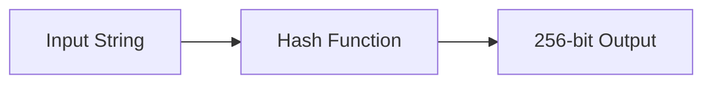
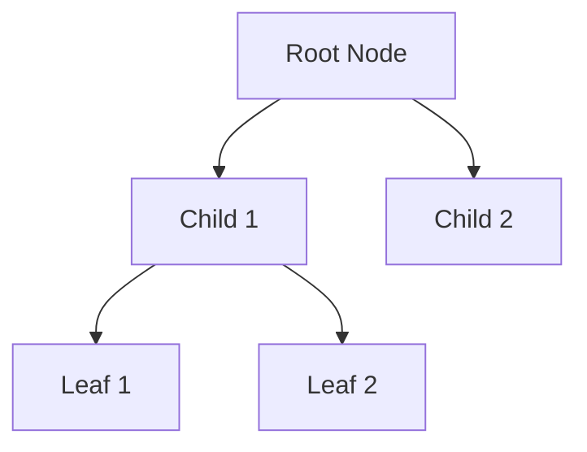
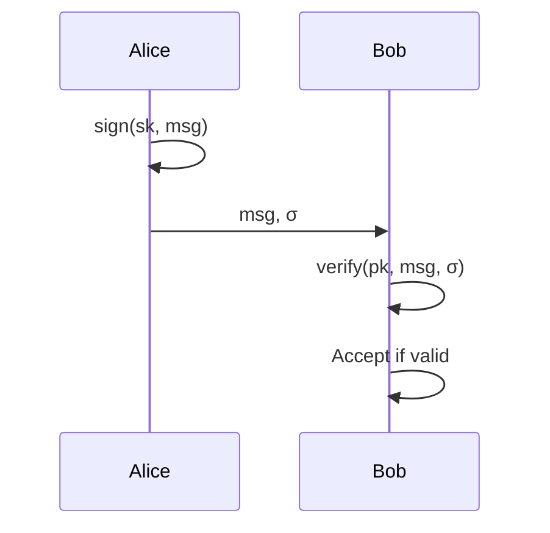

# Lecture Notes Synthesizer - Patterns

## Complete Workflow

```
Input:
Transcripts/<Title>/
├── <Title> - Transcript.md
└── slides/
    ├── slide_0001_3.50s.png
    ├── slide_0002_116.18s.png
    └── ...

Output:
Transcripts/<Title>/
├── <Title> - Transcript.md
├── <Title> - Notes.md  ← NEW
└── slides/
    └── ...
```

## Step 1: List and Sort Slides

```bash
# Get slides sorted by timestamp
ls slides/*.png | sort -t_ -k2 -n
```

Parse timestamps from filenames:
```
slide_0001_3.50s.png    → 3.50 seconds  → 0:03
slide_0002_116.18s.png  → 116.18 seconds → 1:56
slide_0010_1091.96s.png → 1091.96 seconds → 18:11
```

## Step 2: Extract Slide Content via OpenRouter

### API Request Template

```bash
# Encode image to base64
BASE64_IMAGE=$(base64 -i slides/slide_0001_3.50s.png)

# Call OpenRouter API
curl -s https://openrouter.ai/api/v1/chat/completions \
  -H "Authorization: Bearer $OPENROUTER_API_KEY" \
  -H "Content-Type: application/json" \
  -d '{
    "model": "google/gemini-2.0-flash-001",
    "messages": [
      {
        "role": "user",
        "content": [
          {
            "type": "text",
            "text": "Analyze this lecture slide. Extract:\n1. All text (preserve structure)\n2. Math formulas in LaTeX ($...$ inline, $$...$$ display)\n3. Diagrams as Mermaid/ASCII/description\n4. Code snippets with language\n\nOutput clean markdown."
          },
          {
            "type": "image_url",
            "image_url": {
              "url": "data:image/png;base64,'"$BASE64_IMAGE"'"
            }
          }
        ]
      }
    ],
    "max_tokens": 2000
  }'
```

### Alternative Models (via OpenRouter)

| Model | Best For | Cost |
|-------|----------|------|
| `google/gemini-2.0-flash-001` | Fast, good quality | Low |
| `google/gemini-1.5-pro` | Complex diagrams | Medium |
| `anthropic/claude-3.5-sonnet` | Detailed extraction | Medium |
| `openai/gpt-4o` | General purpose | Higher |

## Step 3: Match Transcript Sections

### Timestamp-based Matching

Given slides at timestamps: [3.5s, 116s, 234s, 355s]

For slide at 116s, find transcript between 116s and 234s.

### If Transcript Has Timestamps

```markdown
[0:03] [Music]
[0:16] welcome to the first lecture...
[1:56] in segment 1.1 we're going to talk about...
[3:54] so first Collision free...
```

Extract section between `[1:56]` and `[3:54]` for slide_0002.

### If Transcript Has No Timestamps

Use the summarize tool to get timestamped transcript:
```bash
summarize "URL" --extract --timestamps --format md
```

## Step 4: Generate Insights

After extracting slide content and matching transcript, ask the model:

```
Given this slide content and transcript section, provide:
1. A 2-3 sentence summary of the key concept being taught
2. Why this concept matters in the broader context
3. Any important connections to other topics
```

## Diagram Conversion Examples

### Flowchart → Mermaid

**Original slide shows:** Boxes connected by arrows

**Output:**


### Tree Structure → Mermaid

**Original slide shows:** Hierarchical tree

**Output:**


### Simple Diagram → ASCII

**Original slide shows:** Simple network diagram

**Output:**
```
    +--------+      +--------+
    | Node A |----->| Node B |
    +--------+      +--------+
         |              |
         v              v
    +--------+      +--------+
    | Node C |<-----| Node D |
    +--------+      +--------+
```

### Complex Figure → Description

**Original slide shows:** Complex system architecture

**Output:**
> **Figure: Bitcoin Network Architecture**
>
> The diagram shows a peer-to-peer network where each node maintains a full copy
> of the blockchain. Nodes communicate via a gossip protocol, propagating new
> transactions and blocks. Mining nodes (shown in blue) compete to solve
> proof-of-work puzzles, while light clients (shown in gray) only store
> block headers.

## Math Extraction Examples

### Inline Math
- Original: "The hash H(x) produces a 256-bit output"
- Output: `The hash $H(x)$ produces a 256-bit output`

### Display Math
- Original: Complex equation on slide
- Output:
```latex
$$P(\text{collision}) < \frac{1}{2^{128}}$$
```

### Equation with Explanation
```markdown
The probability of finding a collision is:

$$P = 1 - e^{-\frac{n^2}{2H}}$$

Where:
- $n$ = number of hash attempts
- $H$ = size of hash space ($2^{256}$ for SHA-256)
```

## Complete Section Example

```markdown
## Slide 7 (12:06)

### Content

**Digital Signatures**

A digital signature scheme consists of three algorithms:

1. **Key Generation**: $(sk, pk) \leftarrow \text{generateKeys}(\text{keysize})$
2. **Signing**: $\sigma \leftarrow \text{sign}(sk, \text{message})$
3. **Verification**: $\text{isValid} \leftarrow \text{verify}(pk, \text{message}, \sigma)$



### Transcript

> A digital signature is supposed to be the digital analog to a handwritten
> signature on paper. We want to have two properties that are analogous to
> those of a handwritten signature. First only you can make your signature
> but anyone who sees it can verify that it's valid. Second we want the
> signature to be tied to a particular document so that it can't be used
> to indicate your agreement to a different document...

### Key Insights

Digital signatures provide authentication and non-repudiation in cryptocurrency
transactions. Unlike handwritten signatures, they are mathematically bound to
specific messages, making forgery computationally infeasible. This is the
foundation for proving ownership of Bitcoin without revealing private keys.

---
```

## Output File Structure

```markdown
---
source: https://www.youtube.com/watch?v=VIDEO_ID
type: lecture-notes
date: 2026-01-18
slides: 30
duration: 58:18
tags:
  - lecture-notes
  - cryptocurrency
  - synthesized
---

# Lecture 1 — Intro to Crypto and Cryptocurrencies

> Synthesized from slides and transcript using vision AI

## Slide 1 (0:03)
...

---

## Slide 2 (1:56)
...

---

[... continues for all slides ...]
```
